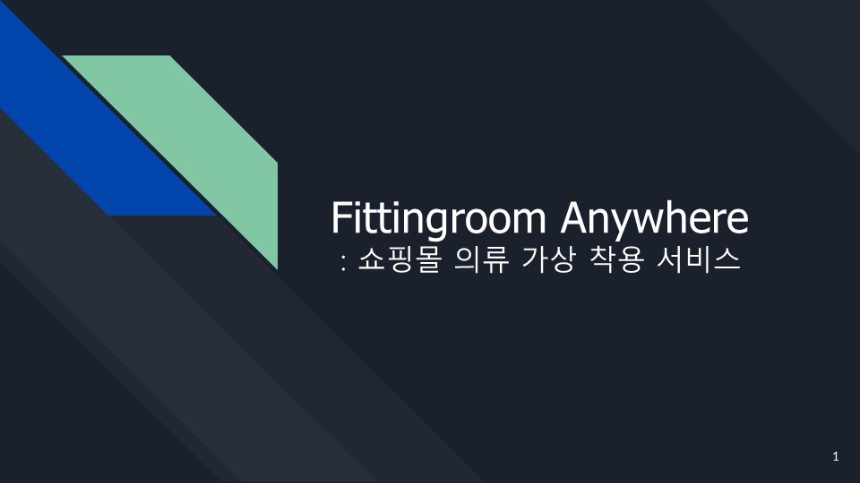

# 개요
이 문서는 2019년 07월 30일에 발표한 6조 중간 발표 자료를 다룹니다.  

저희 서비스는 유저 입장에서 아래와 같은 순서로 진행됩니다. 1. 내 사진 업로드 2. 쇼핑몰에서 옷 선택 3. 선택한 의상을 내 사진에 가상으로 착용한 이미지 생성.    다음 슬라이드에서 그림을 통해 간략히 살펴보겠습니다.

[##_Image|kage@d0uRaW/btqw87mP6g0/005chW9hWd5fmCTmb1V6AK/img.jpg|alignCenter|data-filename="슬라이드4.JPG"|_##]

저희 서비스의 구조도는 다음과 같습니다. 유저의 포즈를 고려하여 쇼핑몰 의류를 합성한 이미지를 생성합니다. 다음 슬라이드에서 어떻게 구현할지 설명드리겠습니다.

[##_Image|kage@DSdcO/btqw8aj9Bck/rDcHQeVXEjl6xEyKJZa5fk/img.jpg|alignCenter|data-filename="슬라이드5.JPG"|_##]

이 시스템은 크게 두 가지 파트로 나눠져 있습니다. 첫째, 세그멘테이션 둘째, Cycle GAN 입니다. 우선 세그멘테이션을 위한 데이터셋은 Deep Fashion2를 사용하기로 했습니다. Deep Fashion 2는 COCO 형식의 거대한 데이터셋으로, 이미지와 세그먼테이션 정보, 랜드마크와 카테고리 등의 annotation이 있습니다.

[##_Image|kage@cDrQy5/btqw9OHlqsT/bCy9vcNW2DfixkhLIeCukK/img.jpg|alignCenter|data-filename="슬라이드6.JPG"|_##]

세그멘테이션 방법으로는 mask r-cnn을 사용하기로 했습니다.

[##_Image|kage@bK49Lz/btqw7wusrJj/dKV9Bu19FkxKp0fXNyKF0k/img.jpg|alignCenter|data-filename="슬라이드7.JPG"|_##][##_Image|kage@q0hel/btqxbds7AwX/1HhjUMeR5vnE9IROAvD4JK/img.jpg|alignCenter|data-filename="슬라이드8.JPG"|_##][##_Image|kage@bHlGxY/btqw6op7OX4/rkhEkLVcknrMhfAIyb2qR0/img.jpg|alignCenter|data-filename="슬라이드9.JPG"|GAN 대략적인 설명입니다._##][##_Image|kage@bnYDxW/btqw85CDNa4/l78pUGFhOpJxnGkDwvESy0/img.jpg|alignCenter|data-filename="슬라이드10.JPG"|_##]

cycle GAN은 이렇게 pair 없는 데이터셋으로도 학습 가능합니다. 얼룩말이 말이 되는 것을 보고 쇼핑몰 옷을 유저 옷으로 바꾸는 데 이용 가능할 것 같아 Cycle GAN을 선택했습니다.

[##_Image|kage@d3KuJF/btqw7cXdubM/pfdbkmmvB7L6SKeKG6SiEK/img.jpg|alignCenter|data-filename="슬라이드11.JPG"|_##][##_Image|kage@bx7wAr/btqw7w8Y26n/k58w8Jhn2orKRZkS0Ko7yk/img.jpg|alignCenter|data-filename="슬라이드12.JPG"|_##][##_Image|kage@WwTrg/btqw7P1x5UK/nsbpstUDPuUVkbh17SFhDK/img.jpg|alignCenter|data-filename="슬라이드13.JPG"|_##][##_Image|kage@dj5Vb0/btqw86O2edI/gHgktM9FqyqU9ucebCIZR1/img.jpg|alignCenter|data-filename="슬라이드14.JPG"|_##][##_Image|kage@bq03Jm/btqw86hgTRp/Kvu3sr8h7PnXWIMmota800/img.png|alignCenter||_##]

좀더 구체적으로 저희 프로젝트의 프레임워크를 보겠습니다. 이 프로젝트는 크게 두 부분으로 나뉩니다.

세그멘테이션, 그리고 GAN.

왼쪽부터 차례로 보겠습니다.

Input image I1은 유저가 올린 사진, Input image I2는 믿어지지 않겠지만 쇼핑몰 사진입니다.. 히힛

I1과 I2는 각각 다른 세그먼테이션 과정을 거치는데요,

I1에서 티셔츠 부분만 인식하여 세그먼테이션 마스크인 S1을 출력합니다.

I2에서는 티셔츠 부분만 인식하여 세그먼테이션을 거쳐 티셔츠의 패턴과 질감인 P1을 추출합니다.

S1으로부터 생성해야 하는 티셔츠의 shape를,

P1으로부터 생성해야 하는 티셔츠의 패턴 및 질감을 얻어왔습니다.

이 S1과 P1을 인풋으로 넣어 가상의 티셔츠를 GAN으로 생성합니다. 이것의 출력이 Out1입니다.

GAN으로 생성한 티셔츠인 Out1과 초기에 유저가 업로드했던 이미지, I1을 합성하여 최종 이미지 Out2를 생성해냅니다.

[##_Image|kage@bqeKtZ/btqw7QlPed5/8YIoIDHkGLp6N7O4HMOcYK/img.jpg|alignCenter|data-filename="슬라이드16.JPG"|_##][##_Image|kage@b4B1tk/btqxbcVh3zb/wWu9QqTSILi6NrDFaRknD0/img.jpg|alignCenter|data-filename="슬라이드17.JPG"|_##]

원래 이렇게 계획했었고 거의 다 완료했습니다. 7월 4주차가 70%인 이유는 여러 모델을 탐색 및 적용해보고 최적인 것을 골라야 하는데 아직 탐색 및 적용 단계이기 때문입니다. 다음 슬라이드에서 저희가 지금까지 뭘 했는지 구체적으로 말씀드리겠습니다.

[##_Image|kage@Ox9xS/btqw7QMV9Kk/QHDrPgFv5EYF0VAFlRjoO0/img.jpg|alignCenter|data-filename="슬라이드18.JPG"|_##][##_Image|kage@b4Pi1U/btqw7P8jpb6/2XFY9yYLgouW7Pjfd8XWrK/img.jpg|alignCenter|data-filename="슬라이드19.JPG"|사진들은 코드를 돌려 본 결과 아웃풋입니다._##][##_Image|kage@bh1qRW/btqw8CHqJK5/MBJKJ8btRhRDe31sQNGZCk/img.jpg|alignCenter|data-filename="슬라이드20.JPG"|_##][##_Image|kage@emE4GH/btqxaDZUiXR/wabZR7gOrKPpvCeTyFIjl0/img.jpg|alignCenter|data-filename="슬라이드21.JPG"|_##][##_Image|kage@6slZi/btqxaEEu4hm/r8eTulyzzUkpWZoF26DaL1/img.jpg|alignCenter|data-filename="슬라이드22.JPG"|_##][##_Image|kage@B3O4b/btqxbds7ACD/AtrJ8hHRXcUeCYh1y8Z0fk/img.jpg|alignCenter|data-filename="슬라이드23.JPG"|_##]

## 나의 의문점

-   GAN으로 쇼핑몰의 옷을 "그대로" 유저의 체형 및 포즈에 맞춰서 생성 가능한가?
    -   GAN을 보니까 특정 distribution을 여러 개 입력받아서 학습한 후 그럴듯한 distribution으로 생성하는 것 같은데.. 예를 들어 말을 얼룩말로 바꾸는 모델을 보자. 어떤 얼룩말 A의 얼룩을 "그대로" 따와서 말에게 입히는 게 아니라 (1)수백장의 얼룩말 사진들을 모아서 (2)일반적인 얼룩말 무늬의 distribution을 학습하여 (3)"일반적인 얼룩말의 무늬"를 그럴듯하게 생성해내는 게 GAN인 것 같다. 그래서 우리의 프로젝트도 "흰 옷" 또는 "줄무늬 옷" 또는 "체크무늬 옷" 등의 패턴을 생성할 수는 있겠지만 "ZARA에서 파는 상품번호XXXX 줄무늬 티셔츠" 를 그대로 생성해낼 수는 없지 않을까.
-   쇼핑몰의 옷을 그대로 유저에게 fit 해주려면 차라리 segmentation 후 적절히 transform 하는 게 낫지 않나.
-   그래도 GAN을 써보고는 싶다!