# 개요
이 문서는 2019년 08월 20일에 발표한 6조 중간 발표 자료를 다룹니다.  

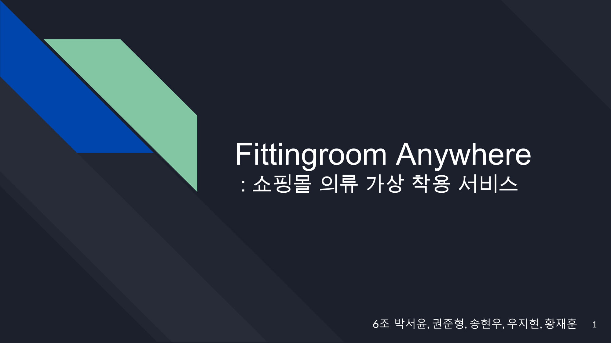
안녕하세요.

저희 조는 쇼핑몰 의류 가상 착용 서비스를 주제로 프로젝트를 진행했고, 이에 대해 발표하겠습니다. 

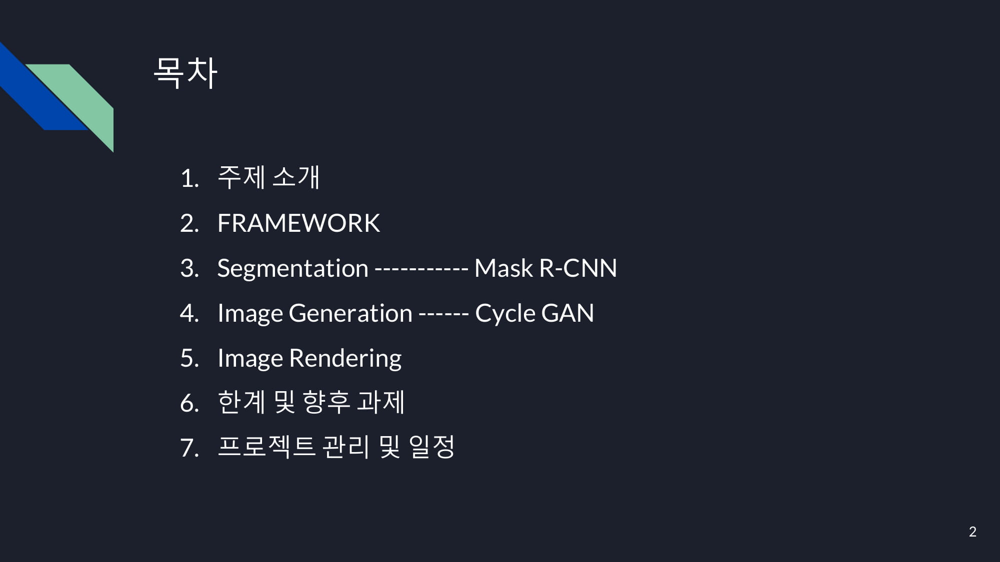
목차를 보겠습니다.

먼저 저희 프로젝트의 주제를 소개하고,

프로젝트의 뼈대를 이루는 프레임워크,

그리고 프레임워크의 각 부분을 이루는 세그멘테이션, 이미지 생성, 그리고 이미지 합성 부분을 각각 볼 것입니다.

그다음 한계점 및 향후 과제, 

지금까지 프로젝트를 어떻게 관리했는지에 대해 말씀드리겠습니다. 

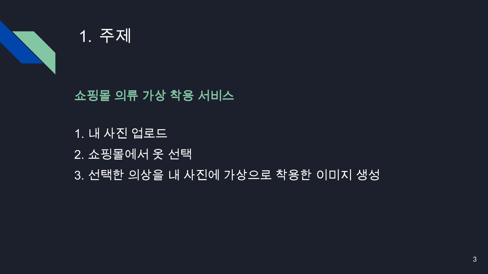
저희 서비스는 유저 입장에서 아래와 같은 순서로 진행됩니다. 

1. 내 사진 업로드 

2. 쇼핑몰에서 옷 선택 

3. 선택한 의상을 내 사진에 가상으로 착용한 이미지 생성. 

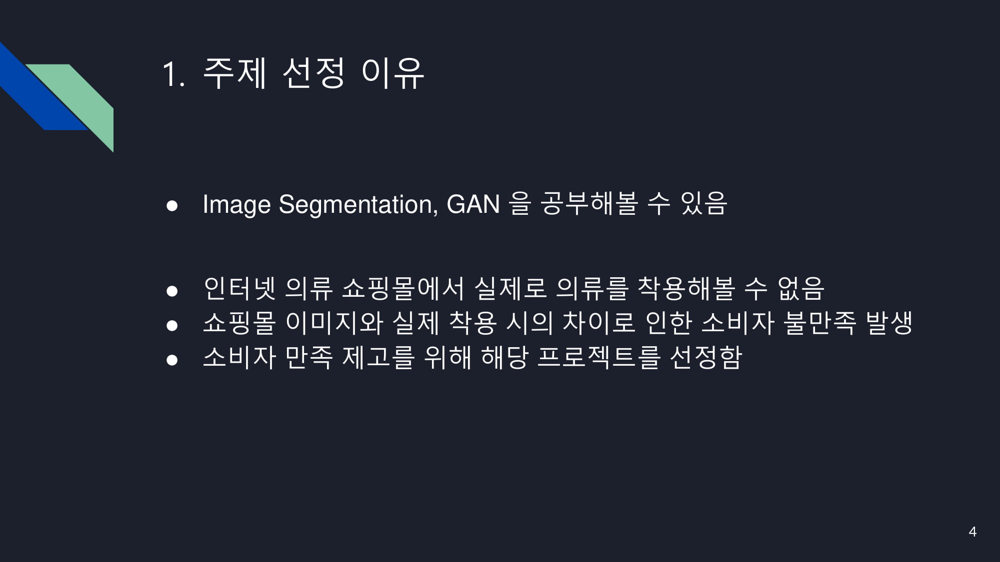
주제 선정 이유는 다음과 같습니다.
저희는 컴퓨터 비전을 공통 관심사로 모인 팀인데요, image segmentation과 gan을 공부해볼 수 있어서 이 프로젝트를 하게 되었습니다.

그리고 인터넷으로 옷을 쇼핑할 때, 배송이 올 때까지 옷이 소비자에게 어울리는지를 알 수 없다는 불편함이 있습니다. 이러한 불편함을, 의류 가상 착용으로 해소해보려는 아이디어에서 출발한 프로젝트입니다.

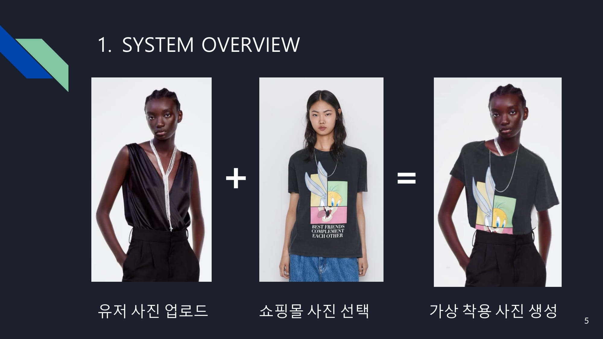
저희 서비스의 개괄적인 구조도는 다음과 같습니다. 유저의 포즈를 고려하여 쇼핑몰 의류를 합성한 이미지를 생성합니다.

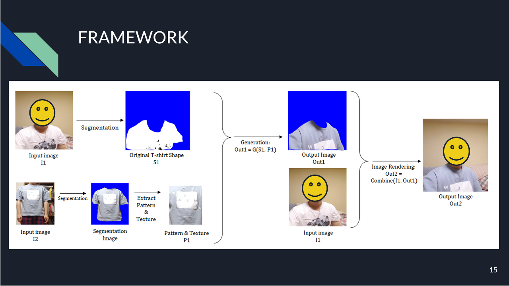
좀더 구체적으로 저희 프로젝트의 프레임워크를 보겠습니다. 

이것은 프로젝트에 착수하기 전에, 저희 팀원이 직접 찍은 사진으로 임의로 만든 프레임워크입니다.

이 프로젝트는 크게 두 부분으로 나뉩니다. 세그멘테이션, 그리고 GAN.

왼쪽부터 차례로 보겠습니다. 

위쪽에 있는 Input image I1는 쇼핑몰 의류 사진, Input image I2는 유저가 올린 사진입니다.

I1에서 티셔츠 부분만 세그먼테이션된 이미지 S1을 출력합니다.

I2에서 티셔츠 부분만 세그먼테이션한 이미지 S2와 티셔츠 제외한 나머지부분인 S3를 출력합니다.

S1은 생성해야 하는 티셔츠의 스타일,

S2은 생성해야 하는 티셔츠의 shape 가 되어 Cycle GAN에 인풋으로 들어갑니다.

Cycle GAN으로 생성한 이미지인 out1 과 S3를 합성하여 최종 아웃풋인 out2가 되는 구조입니다.

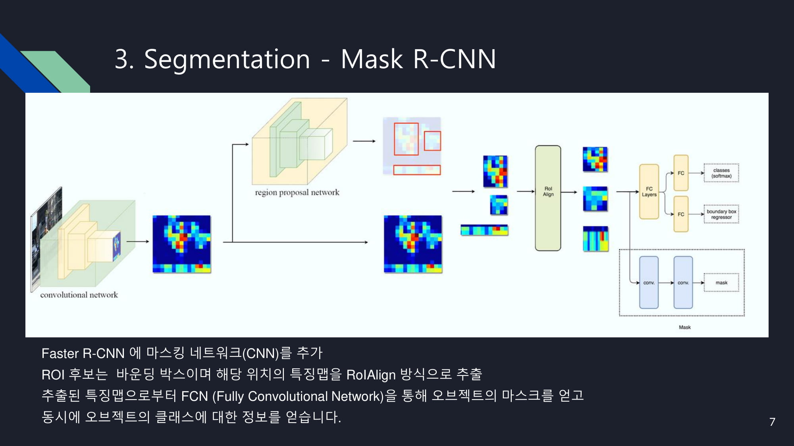
저희는 segmentation을 위해 Mask R-CNN이라는 모델을 사용하기로 했습니다.

Mask R-CNN은 Faster R-CNN에 masking 네트워크를 병렬로 추가한 모델입니다.

오리지날 이미지에서 CNN을 통해 피쳐맵을 추출한 후, 

오브젝트가 어디에 있는지 제안하는 region proposal network를 거칩니다. 

그리고 나서 제안된 region에 ROI align 과정을 거쳐 특징맵의 RoI 영역을 정확하게 정렬되도록 합니다.

추출된 피쳐맵은 Fully Connected layer를 거쳐 클래스와 바운딩 박스를 예측하는 동시에,

병렬로 Fully convolutional network를 거쳐 binary mask를 얻게 됩니다.

이 binary mask를 가지고 해당 픽셀이 오브젝트인지 아닌지를 알 수 있습니다.

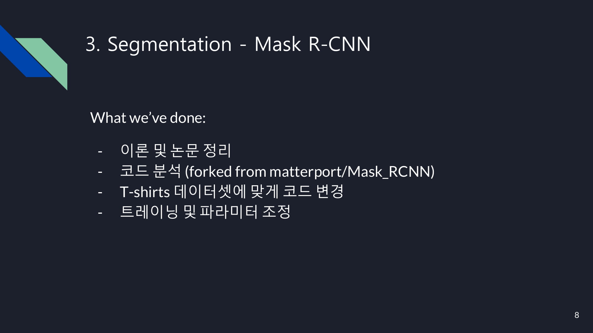
이 Mask R-CNN을 저희 프로젝트에 적용하기 위해서,

저희는 Mask R-CNN 이론 및 논문을 공부하여 정리하였고

깃허브에서 tf keras로 구현된 Mask R-CNN 코드를 다운로드 하여 분석했습니다.

그러고나서 저희 프로젝트에 맞게 코드를 변경하고 모델을 트레이닝했습니다.

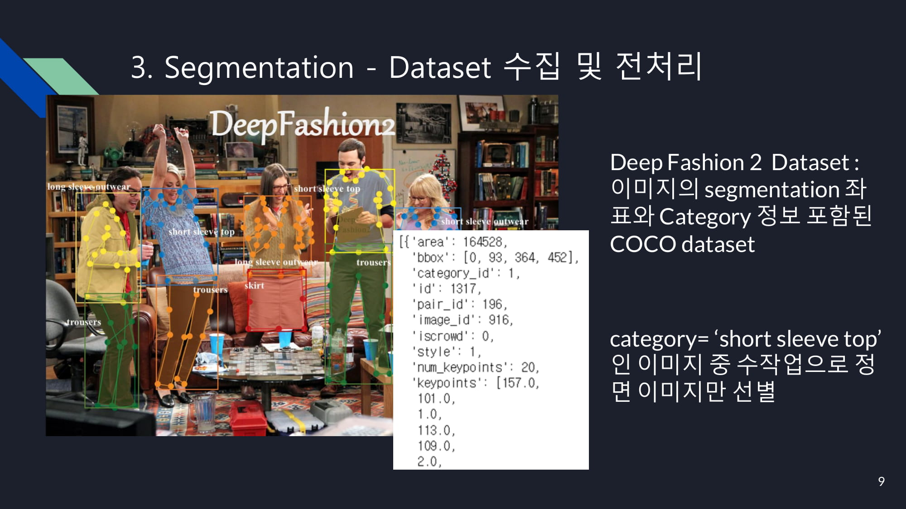
저희는 Segmentation에 쓰일 데이터셋으로 Deep Fashion 2 를 이용하기로 했습니다.

Deep Fashion 2는 COCO 형식의 거대한 데이터셋으로, 

이미지와 그에 대한 어노테이션 파일이 있습니다.

어노테이션 파일은 세그먼테이션 좌표, 랜드마크, 카테고리 등이 있습니다. 

총 13 개의 의류 카테고리가 있는데요, 저희는 티셔츠에 해당하는 ‘short sleeve top’ 카테고리만 골라낸 후

수작업으로 직접 정면에 티셔츠 모양이 뚜렷한 이미지만 선별했습니다.

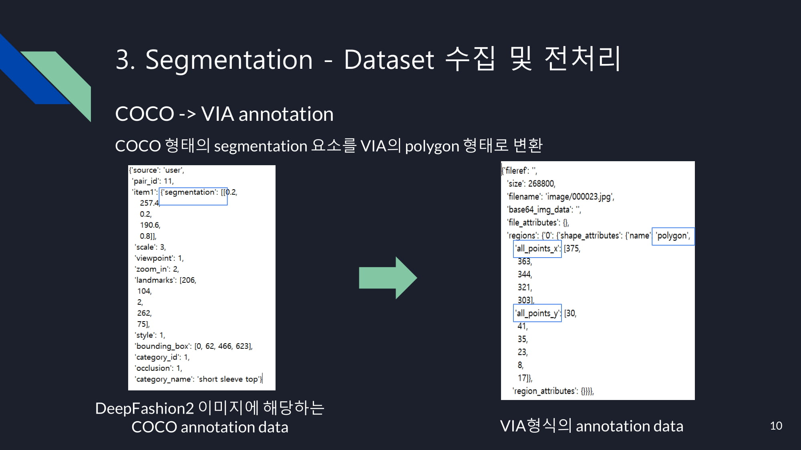
저희가 참고한 Mask R-CNN모델 코드를 보니 VIA 형식의 annotation을 사용하는 것을 알 수 있었습니다.

반면 DeepFashion2 데이터셋은 COCO 형식의 annotation으로 표기되어 있었습니다.

따라서 DeepFashion2의 COCO annotation을 VIA annotation으로 변환했습니다.

이를 위해 annotation을 변환하는 코드를 별도로 만들었습니다.

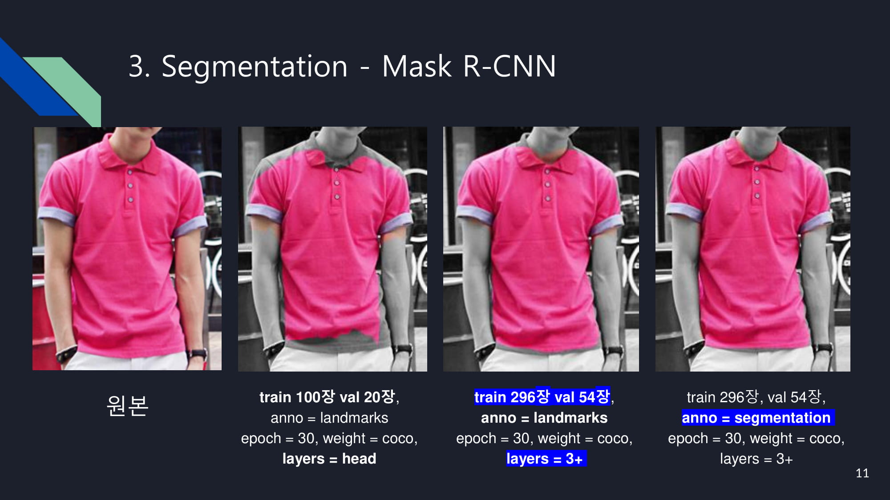
저희는 여러 변주를 주면서 모델을 트레이닝시켰습니다.

가장 왼쪽이 원본이고,

처음에는 트레인 이미지 100장, 밸리데이션 이미지 20장을 넣었습니다.

30epoch에 초기 웨이트는 코코, 그리고 head 레이어만 학습시켰습니다. 

레이어에 대한 부분은 뒤에서 좀 더 설명드리겠습니다.

그다음에는 트레인 이미지 296장, 밸리데이션 이미지 54장을 넣었습니다.

resnet 스테이지 3단계부터 학습시켰습니다.

데이터를 약 3배 늘리니 정확도가 많이 향상된 것이 보입니다.

저희는 여기에서 annotation을 기존에 사용했던 띄엄띄엄 있는 landmark 좌표가 아닌, 

더 촘촘한 segmentation 좌표를 사용해 학습을 시켰습니다. 뒤에서 좀 더 자세히 설명드리겠습니다.

티셔츠 끝부분이나 카라 부분을 보면 정확도가 좀 더 올라간 것을 볼 수 있습니다.

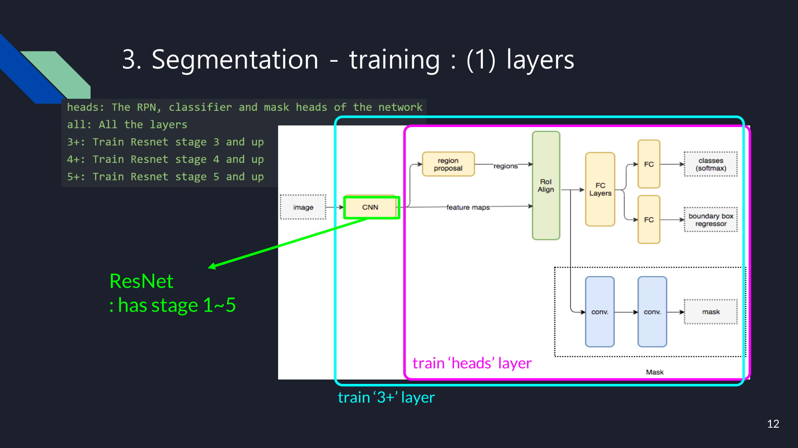
트레이닝 레이어에 대한 설명입니다. 

Mask R-CNN 코드에는 head 만 학습시킬것인지 네트워크 전체를 학습시킬 것인지 등에 대한 옵션이 있습니다. 처음에는 그림에서 분홍색 상자로 표시된 mask r-cnn의 head 부분만 학습시켰다가, 그 후에는 파란색 상자로 표시된 resnet 스테이지 3번째부터 학습을 시켰습니다. 

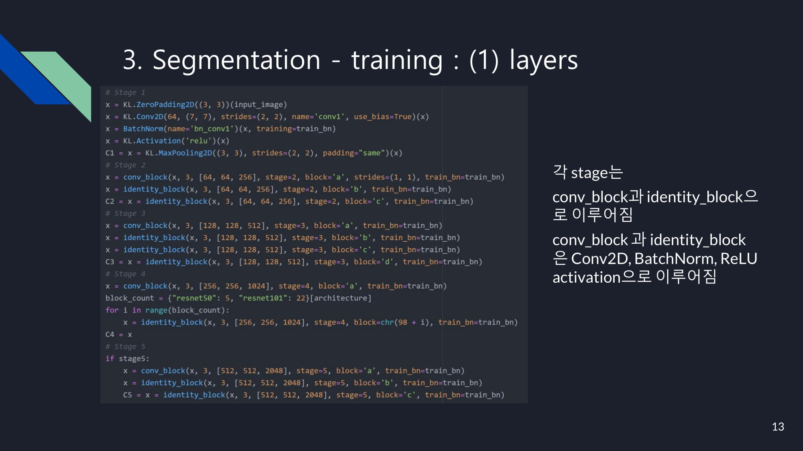

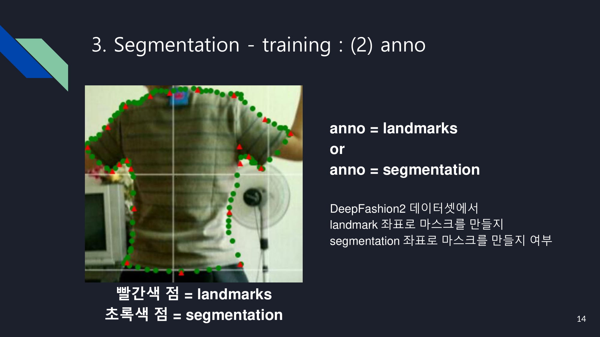
그다음 성능을 향상시키기 위해 한 것은, annotation 수정입니다.

티셔츠를 인식하는 mask를 만들기 위한 학습 데이터로,

티셔츠 사진과, 티셔츠 테두리의 좌표값이 들어갑니다.

먼저 덜 촘촘한 landmarks 좌표를 가지고 학습을 시켰는데 가장자리 정확도가 낮아서, 

촘촘한 segmentation 좌표를 넣었더니 세그멘테이션 정확도가 향상되었습니다. 

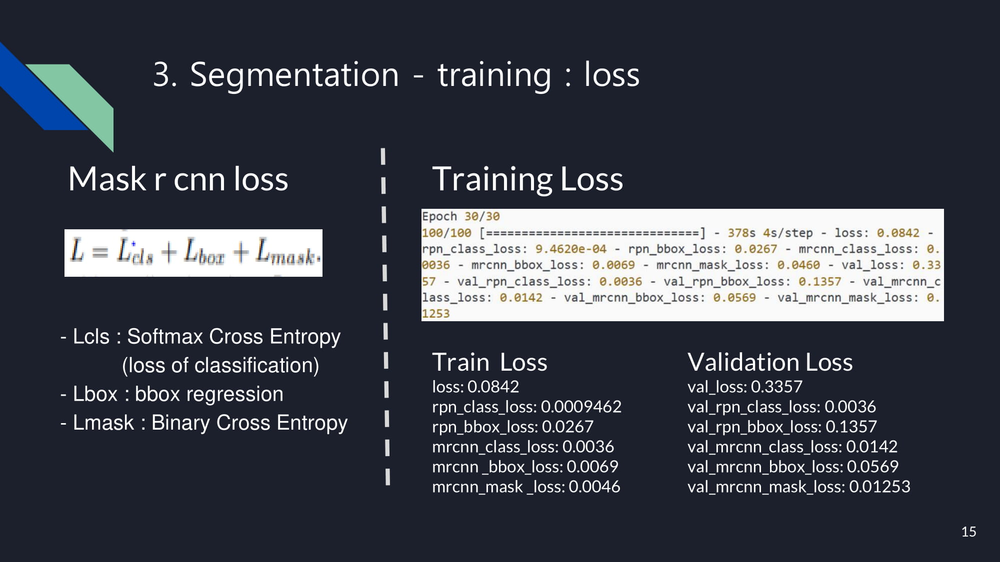
Mask R-CNN의 Loss는 

클래스 로스 + 바운딩 박스 로스 + 마스크 로스의 합으로 정의되어 있습니다.

segmentation mask를 정확히 예측하는 것이 중요하기 때문에,

저희가 중점적으로 본 부분은 마스크 로스입니다.

train set에 대한 mask loss는 0.0046, validation set에 대한 mask loss는 0.01253까지 떨어졌습니다.

epoch30 쯤에서 로스가 수렴했기 때문에 학습을 끝냈습니다.

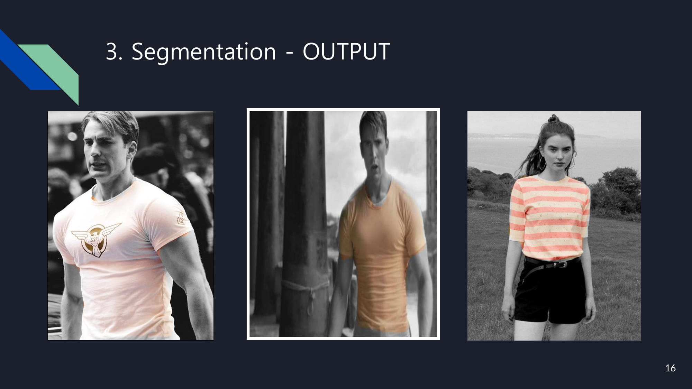
또다른 아웃풋 사진입니다. 측면 이미지, 배경색과 비슷한 이미지, 약간 긴팔인 이미지에 대해서도 세그멘테이션을 잘 하는 것을 알 수 있습니다.

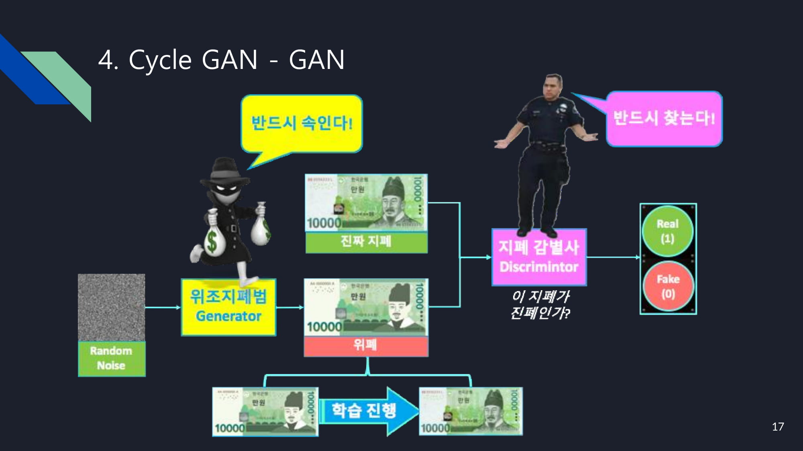
GAN의 대략적인 구조는 이렇습니다.

랜덤 노이즈를 인풋으로 주고

Generator Network가 가짜 이미지를 생성하면 

진짜 이미지와 가짜 이미지를 인풋으로 받은 Discriminator Network가 진위여부를 판단하고 

G와 D가 서로 경쟁하면서 점점 가짜 이미지의 그럴듯함을 높여가는 구조입니다.

좀더 쉽게, 경찰을 속이려는 위조지폐범 과 그 위폐를 완벽히 구별하고자 하는 경찰의 예를 들어보겠습니다.

위조지폐범은 진짜같은 위폐를 만들어서 경찰이 위폐인지 알아차릴수 없도록 만드는것이 목적입니다.

그런데 아마도 위조지폐범이 초기에 만든 위조지폐는 진짜 지폐와 비교해서 이렇게 quality 가 떨어지는 부분이 많을것입니다.

그만큼 경찰에게 잘 발각될 것이구요.

하지만 위조지폐범은 학습을 거듭하면서 경찰이 지폐를 학습할때 어떤 특징을 기준으로 진폐라고 판별하는지를 알아냅니다.

결과적으로 위폐범 (generator) 가 진짜 지폐와 똑같은 위폐를 만들어내면서, 경찰 (discriminator) 이 위폐임을 구별하지 못하게 되고, (Fake 이미지에 대해 무조건 Real 이라고 판별)

위폐범이 목적을 완벽하게 달성했으므로 학습이 종료됩니다.

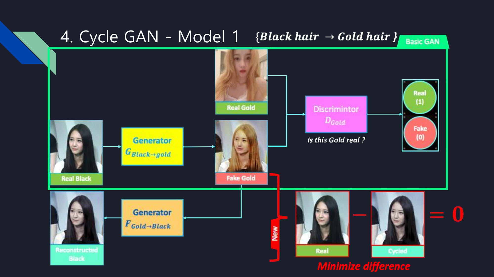
(시작하기 전에 여기나온 사진은 이전과 마찬가지로 저희가 인터넷에서 금발 500장, 흑발 500장을 긁어서 160 epochs 학습했을때의 결과물임을 알려드립니다..)

Cycle Gan 은 기존 Gan 에서 Generated 된 이미지를  원래 이미지로 되돌리는 (기존 GAN 에서 사용했던 generator 에 정반대되는) generator 가 추가된 구조입니다 .

왜 되돌리는 generator 가 필요한걸까요?

generator 가 금발 이미지를 생성할때의 목표은는 generator 가 만든 금발 사진을  discriminator 가 보고 “금발이 맞다”고 판단하게끔 진짜 금발같은 가짜금발사진을 만드는 것입니다.

그런데 우리는 사실 generator (흑발 to 금발) 가 어떤 모양의 금발 이미지를 생성할지 알수없음습니다.

그 말은 generator 가 input 을 뭐로 받던간에 위쪽 Real Gold 와 똑같은 사진을 생성해 내게끔 학습될수도 있다는 뜻입니다.  사실 그렇게 돼도 generator 입장에서는 별문제가 없는 것이, Real Gold 와 똑같은 이미지는 discriminator 가 항상 Real (True or 1) 로 판별하기 때문에, 이렇게하면 generator 의 목적을 100% 달성한것과 같습니다.

그러나 우리는 Real Gold 와 똑같은 금발사진을 원하는것이 아닙니다.
우리는 우리가 input 으로 넣은 흑발 이미지 (Real Black) 에서 정확히 머리카락만 금색으로 바꾼 Fake Gold 같은 사진을 원합니다. 그러려면 generator 가 새로운 이미지를 생성할때, 기존 input 이미지 (Real Black) 의 형태 (머리모양, 얼굴형 등) 를 최대한 그대로 가져갈수 있도록 해야 합니다. 

그래서 생각한 방법이 기존 generator 가 생성한 Fake 이미지 (Fake Gold) 를 다시 원래 input (Real Black) 으로 되돌리는 새로운 generator 를 도입하는 것인데요. 이 새로운 generator 는 input 을 받아서 이미지를 생성하는데, 만든 이미지 (Reconstructed or Cycled)가 가능한 한 GroundTruth (Real Black) 에 가까워지도록 학습합니다. 

결과적으로 기존의 generator (Black to Gold) 는 Fake 이미지를 생성하되, 원래 input 으로 되돌릴수 있을정도로만 input 을 변형하게 됩니다. 따라서 우리는 우리가 원하는 형태의 금발사진 (Fake Gold) 를 얻을수 있습니다.

(참고:  학습을 할때 GAN Loss 와 Cycle Loss 를 ‘함께’ minimize 해야하기 때문에, 기존 generator 에 원래대로 돌릴수 있을정도로만 생성하라고 강제할수 있는것)

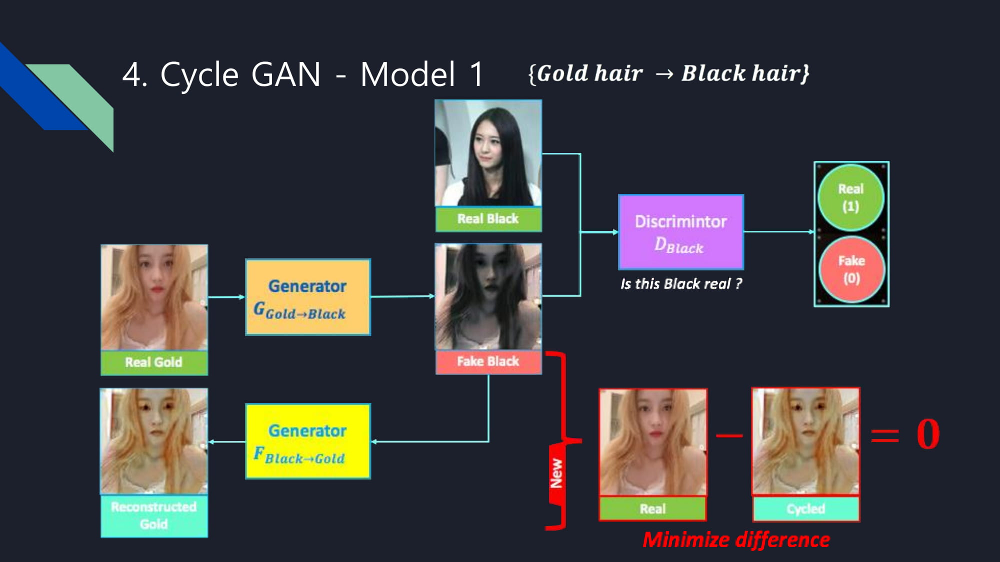
그래서 이미 보유한 component 들을 그대로 활용해서 정반대 Gold to Black 모델을 만듭니다.

이렇게하면 기존의 것도 활용하면서, 여기서는 두번째 generator (Gold to Black) 이 main generator 로 사용되기 때문에, 학습 성능이 더욱 좋아 질것이라고 기대됩니다.

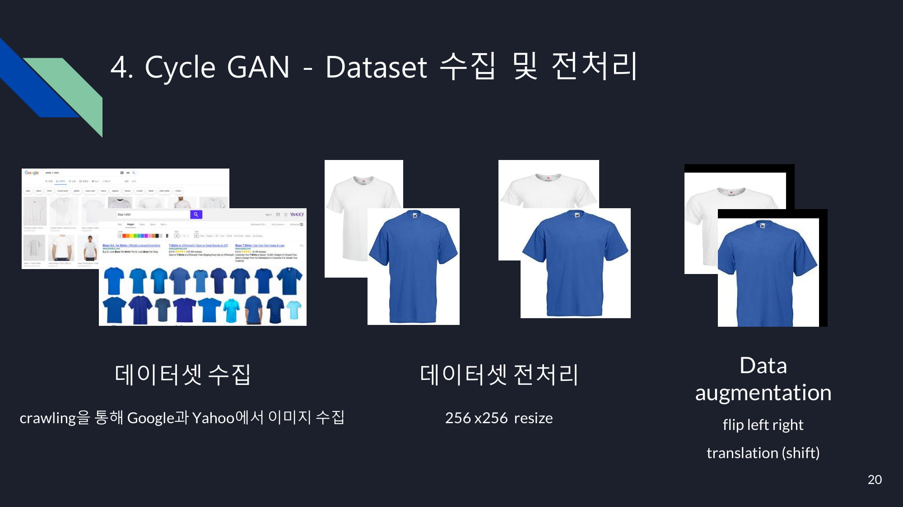
이 Cycle GAN의 원리를 저희 프로젝트에 적용하기로 했습니다.

저희는 크롤링을 통해 CycleGAN을 학습시키기 위한 이미지를 수집하였습니다. 

이를 위해 검색어를 입력받아 yahoo, google에서 이미지를 수집해주는 스크래퍼를 별도로 만들었습니다.

데이터 수집 이후 수작업을 통해 불량한 이미지를 걸러내고 

학습에 용이하도록 이미지 사이즈를 256 x 256 사이즈로 resize 해주었습니다. 

이후 data augmentation을 통해 이미지를 좌우 반전, 이동(translation) 시켜 학습 데이터의 양을 늘렸습니다. 

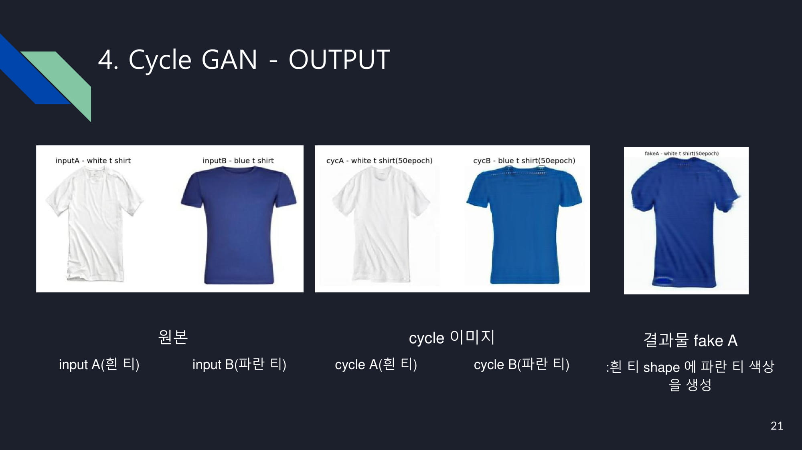
원본은 인풋 A 로 흰티를, 인풋 B로 파란 티를 넣었습니다.

여기서 인풋 A는 쇼핑몰 고객이 현재 입고 있는 옷이며, 인풋B는 유저가 착용하기를 희망하는 쇼핑몰 옷이라고 생각하시면 되겠습니다. 

이제 흰티의 shape에 파란 티의 색상을 입힐 것입니다. 

cycle GAN으로 생성된 이미지, cycle A와 cycle B입니다.

이는 흰티의 shape는 그대로 유지하면서, 스타일만 파란티의 스타일로 바꾸기 위해 필요한 과정입니다.

결과물 fake A는 흰티 shape에 파란티 색상을 성공적으로 입힌것을 볼 수 있습니다.

흰티의 주름 같은 부분도 잘 살렸습니다.

하지만 소매 부분이 날아가거나 둥글게 생성되었다는 아쉬운 점이 있습니다.

이 문제를 해결하기 위해 data augmentation을 넣었습니다.

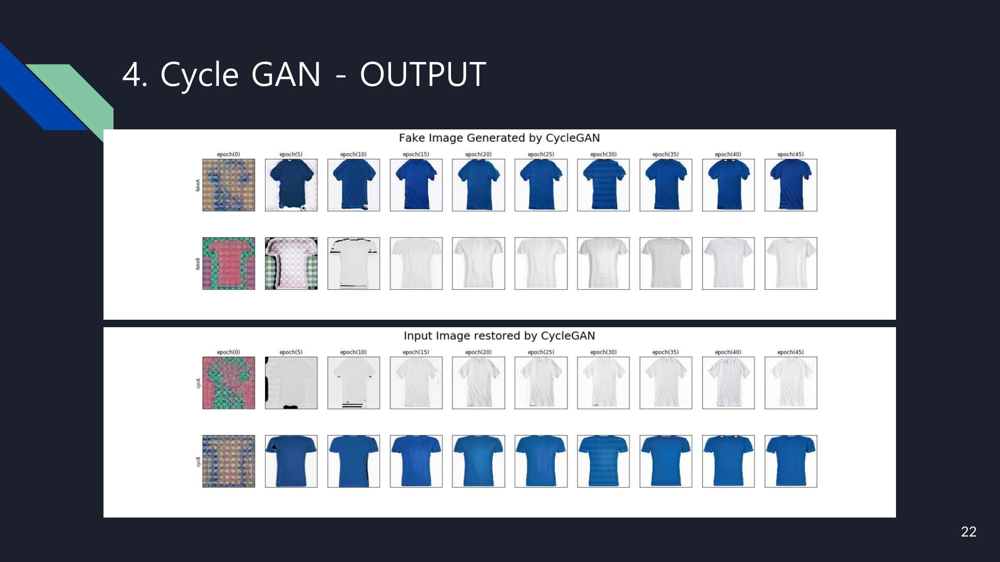
CycleGAN은 구체적인 평가 지표가 부재하기 때문에 시각화를 통해 학습의 결과를 직접 확인해야 합니다. 

위의 이미지는 epoch에 따른 학습의 결과를 보여주고 있습니다. 

하지만 epoch이 늘어 감에 따라 input 이미지가 fake 이미지를 제대로 생성하는 것을 볼 수 있습니다. 

아래의 이미지는 epoch에 따라 원본 이미지를 fake 이미지로 변환 후 다시 원본 이미지로 돌아가는 결과물을 보여주고 있습니다. 

epoch이 늘어 감에 따라 원본 이미지로 더 잘 회귀하는 모습을 확인할 수 있습니다. 

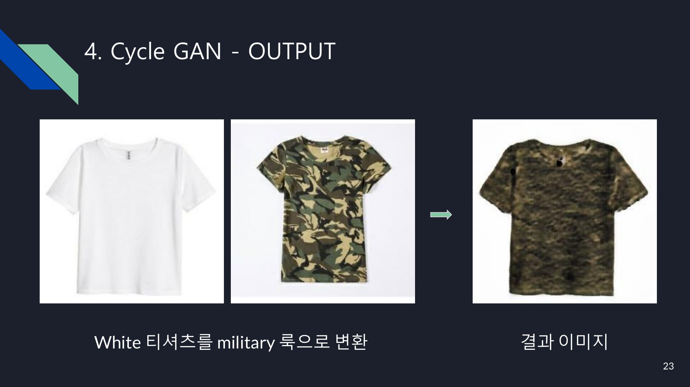
저희는 기존의 색상 변환 외에도 무늬를 변환하는 학습도 시도하였고 결과는 이렇게 잘 나왔습니다.

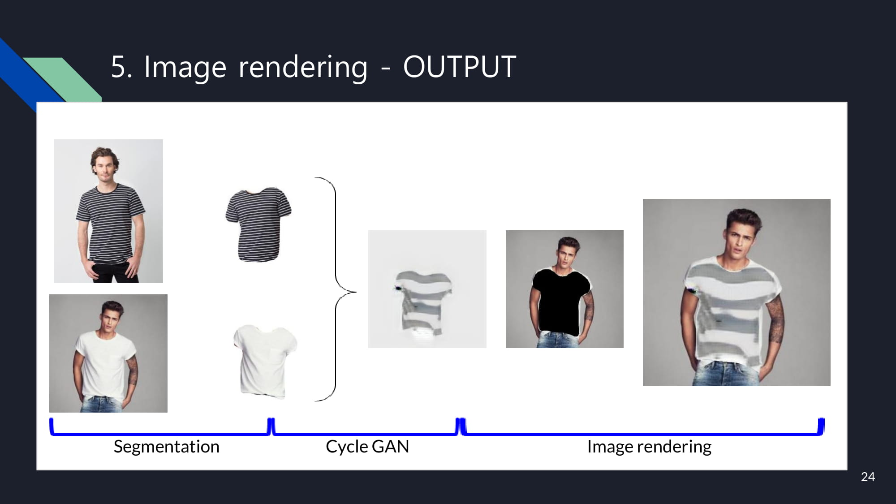
이제 지금까지 만든 모델의 아웃풋을 합쳐볼 시간입니다!

위에 보이는 쇼핑몰 이미지인 줄무늬 티,

아래에 있는 흰 티를 입은 유저 사진을 인풋으로 넣었습니다.

세그멘테이션과 Cycle GAN을 거친 아웃풋 사진이 위와 같고,

티셔츠를 제외한 background 이미지와 합성한 사진이 가장 마지막 사진입니다.

사실 이 과정은 한번에 된 것이 아니라,

Segmentation의 아웃풋과 Cycle GAN의 아웃풋을 각각 받아서,

합성하는 코드를 거쳐 만든 이미지입니다.

나중에 전체 프로세스를 통합할것입니다.

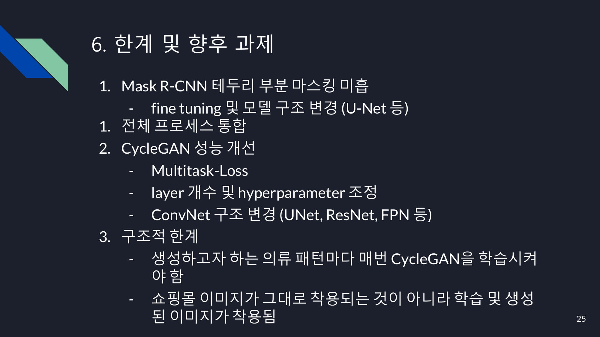
저희 프로젝트의 한계 및 향후 과제입니다.

첫째, 마스크 RCNN의 테두리 부분 마스킹이 미흡합니다. 

이 문제를 해결하기 위해 fine tuning과 모델 구조 변경 등의 작업을 통해 성능을 향상시킬 것입니다.

둘째, 세그멘테이션과 CycleGAN, 이미지 합성의 전체 프로세스를 통합해야 합니다.

셋째, Cycle GAN의 성능을 개선해야 합니다. 

다음과 같은 방법을 통해 Cycle GAN 성능을 향상시킬 것입니다.

마지막으로 Cycle GAN을 사용함으로써 발생하는 한계가 있습니다.

저희는 완성된 서비스를 목표로 하지 않고, 딥러닝에 흠뻑 빠지는 것을 목표로 했기 때문에 Cycle GAN을 통해 의류를 생성하도록 했는데요. 따라서 
생성하고자 하는 의류 패턴마다 매번 Cycle GAN을 학습시켜야 하는 한계가 있습니다. 

또, 쇼핑몰 의류가 유저에게 그대로 착용되는 것이 아니라, 비슷한 패턴을 학습하여 생성된 이미지가 착용됩니다.

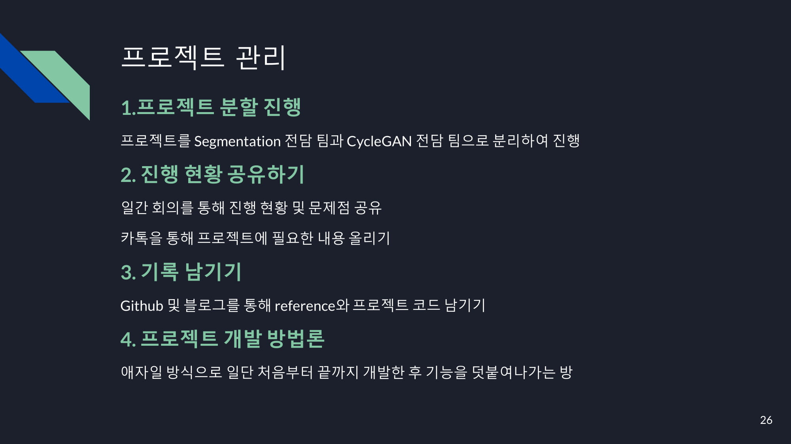
프로젝트 관리는 이렇게 했습니다.

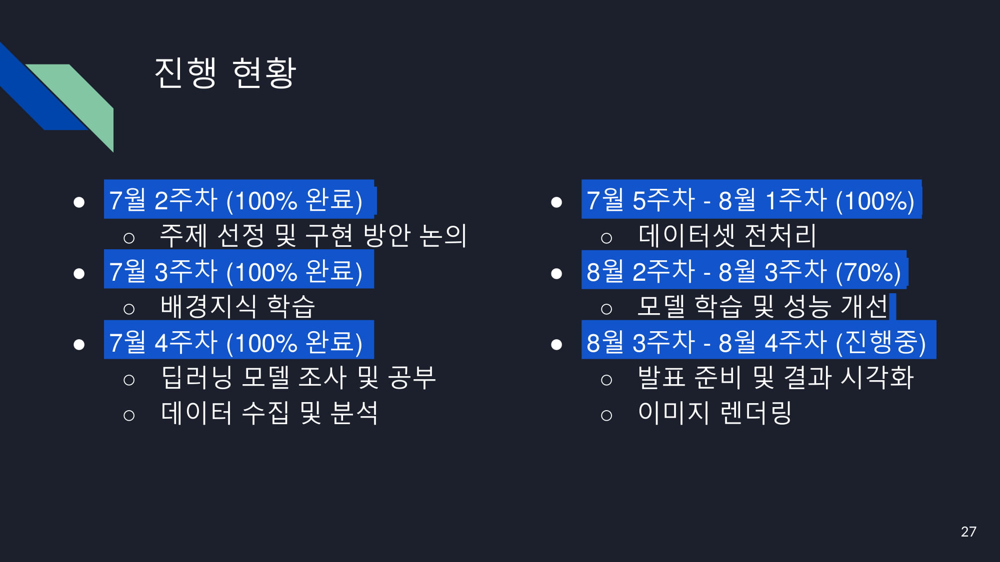
계획대로 진행되었고, 최종발표까지는 모델 성능 개선 및 통합에 중점을 두고 진행할 예정입니다.

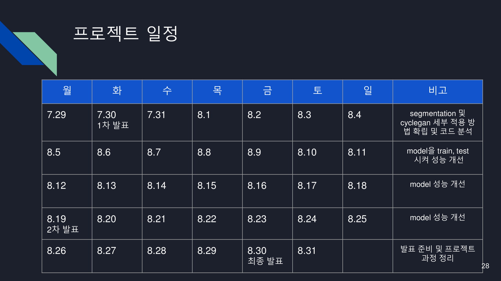
앞으로 남은 일정 동안 대략적으로 이렇게 진행할 것입니다.

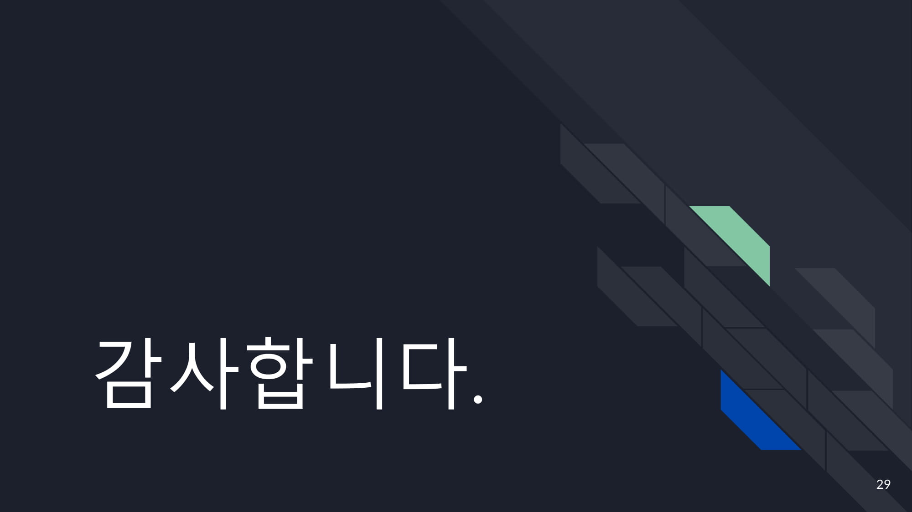

